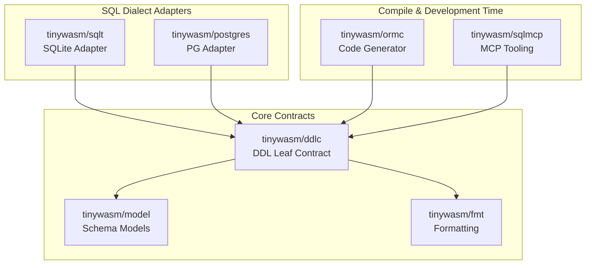

# ARCHITECTURE — ddlc (DDL Compiler / Contract Leaf)

This document describes the architectural split, rationale, and dependency design for the DDL compiler contract in the tinywasm SQL ecosystem.

## Why the Split Exists

Previously, the DDL exporter interfaces, Kahn's topological sort, and the `FieldExt` schema extension struct were located inside the core runtime `tinywasm/orm`. This caused several architectural issues:
1. **Unnecessary Version Bumps:** Any change or patch to the core runtime ORM forced updates and new releases of the database adapters (`sqlt` and `postgres`) and developer CLI tools, even when no DDL contracts were changed.
2. **Heavy Dependencies at Runtime:** Applications compiling the core ORM to lightweight target environments (like WebAssembly/WASM) were forced to pull in topological sort algorithms and database schema-export machinery.
3. **Circular Imports:** The CLI compile-time tools need to import the SQL adapters (`sqlt`, `postgres`) to output the physical SQL schemas. If those SQL adapters depended on core ORM sub-packages that in turn coupled back to CLI helpers, import cycles could easily occur.

By splitting `ddlc` into a dedicated package, we isolate compile-time DDL contracts from runtime query execution.

## Dependency Diagram

The following diagram illustrates the dependency flow. `ddlc` is a leaf package that only depends on `model` and `fmt`.

## Why `FieldExt` lives in `ddlc` and not in `model`

`FieldExt` defines database-specific metadata such as foreign key references (`Ref`), referenced columns (`RefColumn`), and referential actions (`OnDelete`).

- `tinywasm/model` represents the core transport-agnostic schema of a model (used by JSON codecs, form inputs, validation, and domain layers).
- Foreign keys and database referential integrity are purely relational storage concepts. Exposing them inside `model` would pollute transport/UI representations with database constraints.
- Keeping `FieldExt` in `ddlc` keeps `model` clean while providing a clear interface (`SchemaExt`) for relational SQL adapters to declare foreign key constraints.
